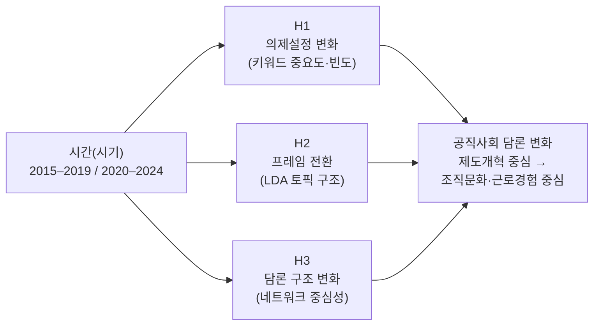
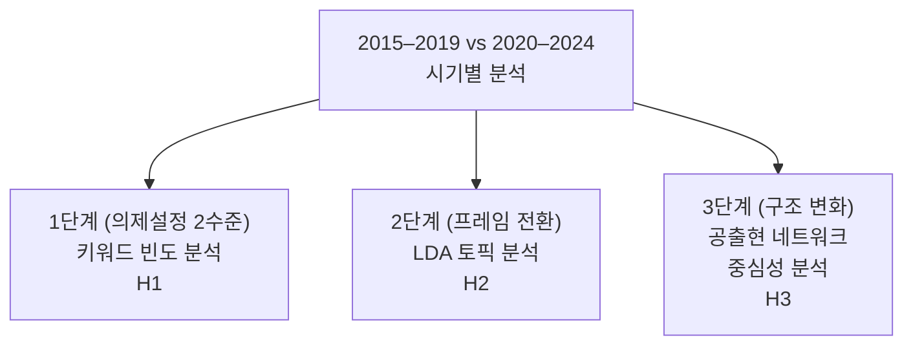
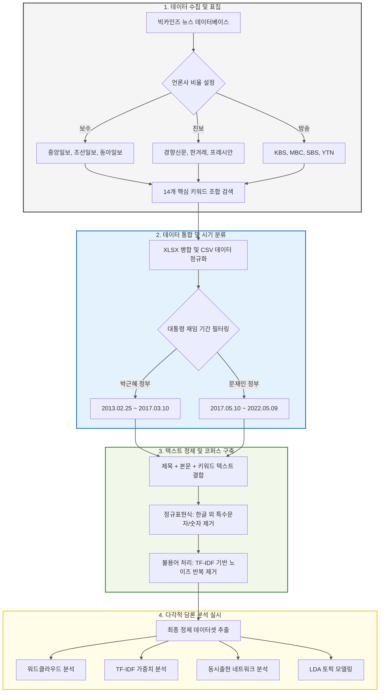

## 공직사회 담론의 변화 분석: 2015~2024년 한국언론진흥재단 빅카인즈 뉴스 데이터 기반 토픽모델링 연구

### 📘 프로젝트 개요

본 프로젝트는 2015년부터 2024년까지의 공직사회 관련 뉴스 담론을 텍스트마이닝 기법으로 분석하여,
시기별 토픽 변화와 핵심 키워드의 변화를 파악하는 것을 목표로 함

### 연구목적

> 본 연구 목적은 지난 10년간(2015~2024년) 한국 언론에서 나타난 '공직사회' 관련 담론의 변화를 시계열적으로 분석하고자 함

- 공직 개혁 및 조직 혁신에 대한 사회적 인식이 어떠한 방향으로 변화했는지 파악
- 세대 갈등, 청년, 근무제 등 주요 키워드가 어떠한 주제 구조 속에서 등장, 소멸, 재구성 되는지를 탐색
- 이를 통해 향후 공직제도 개편 및 정책 커뮤니케이션이 어떤 방향으로 변화해야 하는지 시사점을 도출하고자 한다.

### 연구이론 및 개념적 논의

1. 공직사회 변화 이론 — 신공공관리론(NPM)과 거버넌스 이론을 중심으로 공직조직의 효율성과 책임성 간의 긴장 구조를 설명.

2. 세대갈등 담론이론 — 사회 구성주의 관점에서 세대 정체성과 조직 내 갈등의 언어적 재현 과정을 분석.

3. 조직혁신 담론 프레임 — Lewin의 변화이론(해빙–변화–재동결) 및 Kotter의 8단계 변혁모형을 바탕으로, 기사 속 ‘변화’의 프레임을 해석.

4. 미디어 의제설정이론 — 언론의 보도 빈도 및 키워드 연관성이 공공 인식 형성에 미치는 영향을 토대로, 주제 변화의 사회적 함의를 논의.

### 연구모형



> 본 연구의 연구모형은 시기를 독립변수로 설정하고, 의제 수준(H1), 프레임 수준(H2), 구조 수준(H3)의 변화를 매개 분석 차원으로 하여 공직사회 담론의 구조적 전환을 설명하는 비교 연구모형이다. 이러한 연구모형은 공직사회 담론 변화의 다층적 성격을 체계적으로 분석할 수 있는 분석 틀을 제공한다.

### 연구설계

| 단계                                   | 분석 내용                   | 연구가설 |
| -------------------------------------- | --------------------------- | -------- |
| **2015–2019 vs 2020–2024 시기별 비교** |
| **1단계(의제설정 2수준)**              | 키워드 빈도 분석            | **H1**   |
| **2단계(프레임 전환)**                 | LDA 토픽 분석               | **H2**   |
| **3단계(구조 변화)**                   | 공출현 네트워크 중심성 분석 | **H3**   |



### 연구방법

#### 분석절차



#### 자료수집

- 한국얼론진흥재단 빅카인즈(KINDS) 뉴스 빅데이터에서 `공직사회`, `세대 갈등`, `청년`, `공직 개혁`, `조직 혁신` 키워드로 2015년 1월 ~ 2024년 12월 까지 기사 `172건` 크롤링

본 연구에서 확보된 기사 172건은 공직사회·세대 갈등·근무 혁신 등 특정 정책 담론을 다루는 뉴스의 실제 생산량을 반영한 자연적 표본이며, 텍스트마이닝 기반 의제설정·프레임 변화 분석에서 요구되는 최소 문서량(약 50~100건)을 충족한다. 또한 두 시기(2015–2019년 71건 / 2020–2024년 101건) 모두 충분한 기사 수가 확보되어 시기별 비교 분석이 가능하며, TF-IDF·LDA·네트워크 중심성 분석은 문서 수 차이를 자동 조정하는 정규화 기반 알고리즘을 사용하여 표본 불균형으로 인한 편향을 최소화하였다.

두 시기(2015–2019: 71건 / 2020–2024: 101건)의 문서량 차이를 보정하기 위해 분석 전반에 정규화 절차를 적용하였다. TF-IDF는 문서 수 대비 단어 중요도를 자동 조정하며, 빈도 기반 분석은 문서 수로 나눈 normalized frequency를 사용하였다. 네트워크 중심성 지표는 고유적으로 정규화된 값이므로 시기 간 비교에 영향을 미치지 않는다.

#### 데이터 정제

- 중복기사, 제목만 존재하는 기사, 특수문자 및 광고성 문구 불용처리
- 정제 후에도 172건 모두 유지(불용처리 과정이 텍스티 내에서 단어 단위 정제에 국한되었기 때문)

#### 형태소 분석

- `KoNLPy` 의 Okt를 이용해 명사 추출

본 연구는 한국어 자연어처리에 널리 활용되는 KoNLPy 기반의 Okt 형태소 분석기를 사용하였다. 다만 Okt는 복합명사 분리, 동사·형용사의 명사화 처리 등에서 구조적 한계를 갖고 있어 일부 의미 단위가 단편화될 가능성이 존재한다. 예를 들어 ‘근무혁신’이 ‘근무’와 ‘혁신’으로 분리되거나, ‘개선되다’와 같은 서술어 정보가 명사 기반 분석에서는 충분히 반영되지 않을 수 있다.
그러나 본 연구는 정책·조직 담론에서 핵심 개념어의 출현 패턴과 구조적 변화를 살피는 데 목적이 있으므로, 고빈도 명사 중심 분석은 해당 목적에 부합하는 표준적 방법론이다. 명사 단위 분석은 정책·사회과학 텍스트마이닝 연구에서 의제의 ‘개념적 구조’를 파악하는 데 적합하며, 선행연구에서도 일반적으로 사용되는 방식이다.

- 불용어 리스트로 불용어(정치 및 기관명, 정치인 및 정당, 지명 및 지역, 불필요 연결어 및 기능어, 사건 사고 및 뉴스용어, 역사, 국가 보훈, 일반 사회어, 기타 불필요한 단어) 제거

불용어는 분석 목적에 따라 체계적으로 구성하였다. 기능어·조사·접속사 등 의미적 가치가 없는 단어, 특정 인물·정당·기관명 등 사건 중심 고유명사, 뉴스 작성 구조에서 발생하는 잡음 단어(사진, 속보, 기자 등), 그리고 본 연구 주제와 직접적 연관성이 없는 일반 사회어를 제외하였다. 또한 한국어의 특성상 독립적 의미를 가지기 어려운 한 글자 단어를 제거하고, 정책·조직 담론의 핵심 개념어 중심 분석이 가능하도록 재현 가능한 stopwords 리스트를 구성하였다.

#### 토픽모델링

- `gensim`의 LDA(Latent Dirichlet Allocation) 알고리즘 사용
- 최적 토픽 수(k)는 3개로 결정
- 2구간 비교 분석(two-period comparison)
  > ① 2015 ~ 2019: 제 1시기 - 과거 시점의 사회 인식 구조
  > ② 2020 ~ 2024: 제 2시기 - 최근 시점의 사회 인식 구조

본 연구에서는 LDA 토픽 수(k)를 3으로 설정하였다.
Coherence Score는 참고 지표로 활용하였으나, 한국어 명사 기반 코퍼스의 특성상 k 증가에 따라 단조 증가하는 경향이 확인되었다.
이에 따라 해석 가능성, 시기별 비교 가능성, 그리고 두 시기 모두 세 개의 상위 담론(세대·청년 갈등, 노동·조직문화, 연금·제도개혁)으로 자연스럽게 수렴되는 경험적 결과를 종합적으로 고려하여 k=3을 최종 토픽 수로 결정하였다.
이는 2015–2019과 2020–2024 두 시기의 담론 구조를 동일한 기준 아래 비교하기에 가장 적절한 수준의 의미 단위를 제공한다.

#### 시각화

- `matplotlib`을 이용하여 시기별 주요 키워드 빈도 변화를 시각화
- `wordcloud`를 활용하여 각 시기별 주요 토픽 단어 분포를 시각화

### 연구설계

1. 연구대상:
   빅카인즈(BigKinds) 뉴스 데이터베이스에 수록된 기사(2015년 1월~2024년 12월) 중
   ‘공직사회’, ‘조직문화’, ‘근무제도’, ‘세대’ 관련 주요 기사 172건
2. 분석단위: 기사 본문 내에서 추출된 주요 명사 단어 단위
3. 분석방법: 텍스트마이닝(Text Mining)을 기반으로 한
   공출현 네트워크 분석(co-occurrence network) 및
   LDA 토픽모델링(Latent Dirichlet Allocation)을 적용한 시기별 비교 분석
4. 비교구간: 2015 ~ 2019 / 2020 ~ 2024 두 시기로 구분하여 이전기–이후기 담론 변화를 비교
5. 주요변수: 공직개혁, 근무제, 청년, 세대갈증, 조직혁신 등

### 연구결과 개요

> 분석 결과, 공직사회 담론이 제도 중심의 개혁 논의에서
> 조직문화 및 개인 중심의 혁신 담론으로 이동하였음을 확인하였다.
> 이는 정책 커뮤니케이션 전략 또한 세대별 가치 인식과
> 조직 내 자율성 강화를 중심으로 재구조화될 필요성을 시사한다.

- 2015–2019년:
  ‘공직 개혁’, ‘비정상·관행’ 등 제도적 개혁 중심 담론이 주도.
  → 공공제도의 효율성, 연금 및 조직 개편에 초점.

- 2020–2024년:
  ‘근무 혁신’, ‘워라밸’, ‘공직윤리’, ‘세대 갈등’, ‘MZ세대 공무원’,
  ‘정년 연장’, ‘유연근무제’ 등이 부상하며
  조직문화와 세대 가치 중심 담론으로 전환.

### 데이터 구조

- `datas/clean_2015_2019.csv`
- `datas/clean_2020_2024.csv`

각 CSV 파일은 전처리된 기사 본문(`clean_text`)을 포함하며,
불용어(stopwords) 제거 및 형태소 분석(Okt 명사 추출)을 거친 데이터

## ⚙️ 환경 설정

### 1️⃣ 가상환경 생성 및 활성화

```bash
python -m venv .venv
source .venv/bin/activate        # macOS / Linux
.venv\Scripts\activate           # Windows
```

```
.\.venv\Scripts\Activate.ps1
```

2️⃣ 필수 패키지 설치

```
pip install -r requirements.txt
```

주요 패키지
pandas, numpy, matplotlib, seaborn
konlpy, gensim, scikit-learn
wordcloud, networkx, tqdm

### 데이터 셋 정보

```
 [기사 개수 요약]
• 원본 기사 수 (2015–2019): 71건
• 원본 기사 수 (2020–2024): 101건
→ 총 원본 기사 수: 172건

• 정제 후 기사 수 (2015–2019): 71건
• 정제 후 기사 수 (2020–2024): 101건
 최종 정제 기사 수 합계: 172건

 [언론사별 기사 분포 상위 10개]
 - 경향신문      : 47건 (27.3%)
 - 한국일보      : 35건 (20.3%)
 - 중앙일보      : 35건 (20.3%)
 - 한겨레       : 22건 (12.8%)
 - 조선일보      : 19건 (11.0%)
 - 동아일보      : 14건 (8.1%)
```

### 분석 절차

본 연구는 2015년부터 2024년 상반기까지의 공직사회 관련 뉴스 기사를 대상으로,
텍스트 전처리 → 명사 추출 → 불용어 제거 → 토픽모델링 및 네트워크 분석 → 시기별 비교 시각화
의 단계로 진행

1️⃣ Excel → CSV 변환 (01_convert_excel_to_csv.py)

목적: datas 폴더 내의 모든 .xlsx 파일을 자동으로 탐색하여 CSV 파일로 일괄 변환

```
excel_files = glob.glob("../datas/*.xlsx")
for file in excel_files:
    df = pd.read_excel(file, engine="openpyxl")
    df.to_csv(f"../datas/{os.path.basename(file).replace('.xlsx', '.csv')}",
              index=False, encoding="utf-8-sig")

```

출력: public_perception_2015_2019.csv / public_perception_2020_2024.csv

2️⃣ 데이터 구조 확인 (02_check_columns.py)

목적: 변환된 CSV 파일의 컬럼명, 데이터 크기, 샘플 데이터를 확인하여 이후 전처리 구조를 점검

```
df1 = pd.read_csv("../datas/public_perception_2015_2019.csv")
df2 = pd.read_csv("../datas/public_perception_2020_2024.csv")
print(df1.columns, df2.columns)

```

3️⃣ 텍스트 통합 및 정제 (03_preprocess_text.py)

목적:

- 기사 제목, 본문, 키워드, 특성추출 텍스트를 `하나의 컬럼(text)`으로 결합
- 한글 및 공백만 남기고 정제

```
def combine_text(df):
    df["text"] = (
        df["제목"].fillna("") + " " + df["본문"].fillna("") +
        " " + df["키워드"].fillna("") + " " + df["특성추출(가중치순 상위 50개)"].fillna("")
    )
    df["text"] = df["text"].apply(lambda x: re.sub(r"[^가-힣\s]", " ", str(x)))
```

출력: preprocessed_2015_2019.csv / preprocessed_2020_2024.csv

4️⃣ 명사 추출 + 불용어 제거 (04_clean_text.py)

목적:

- 형태소 분석기 Okt를 이용해 명사만 추출
- stopwords.py에서 지정한 불용어를 제거
- 최종적으로 분석용 텍스트(clean_text) 생성

```
okt = Okt()
def clean_text(text):
    text = re.sub(r"[^가-힣\s]", " ", str(text))
    nouns = okt.nouns(text)
    return " ".join([n for n in nouns if len(n) > 1 and n not in STOPWORDS])
```

출력: clean_2015_2019.csv / clean_2020_2024.csv

5️⃣ 빈도 분석 및 워드클라우드 (05_wordcloud_compare.py)

목적:

- 각 시기의 명사 출현 빈도를 계산
- 상위 30개 단어를 시각화하여 시기별 핵심 키워드를 비교

```
count_15_19 = Counter(nouns_15_19)
wc = WordCloud(font_path=font_path, background_color="white").generate_from_frequencies(count_15_19)
```

출력: freq_2015_2019.csv, freq_2020_2024.csv, wordcloud_compare.png

6️⃣ TF-IDF 기반 키워드 변화율 분석 (06_keyword_change.py)

목적:

- TF-IDF 가중치를 계산하여 두 시기의 주요 단어 중요도 변화율(%) 분석
- 사회 담론의 상대적 강조점 변화 확인

```
vectorizer = TfidfVectorizer(max_features=1000)
tfidf1 = vectorizer.fit_transform(df1["clean_text"])
tfidf2 = vectorizer.fit_transform(df2["clean_text"])
change["증감률(%)"] = ((change["2020_2024"] - change["2015_2019"]) /
                      change["2015_2019"].replace(0, 0.0001)) * 100

```

출력: keyword_change.csv

7️⃣ 공출현 네트워크 분석 (10_cooccurrence_network.py)

목적:

- 기사 내 단어쌍의 공출현(co-occurrence) 빈도를 계산하고, 단어 간 관계를 NetworkX 기반 그래프로 시각화

공출현 네트워크(co-occurrence network)는 기사 단위(window size = 전체 문서)를 기준으로 계산하였다. 즉, 동일 기사 내에서 함께 등장한 단어쌍을 하나의 공출현 관계로 간주하여 edge를 구성하였다. 이는 문장 단위(window size = sentence-level)에 비해 담론 단위 의미 구조를 더 안정적으로 반영한다.
정책·조직 담론 분석에서는 개별 문장이 아닌 기사 전체가 하나의 의미 단위(discursive unit)로 기능하기 때문에, 문서 단위 공출현이 담론 구조 변화와 중심 개념의 상관성을 더 잘 나타낸다. 반면 문장 단위 window는 지나치게 미시적 granular 분석이 되어, 시간·시대 담론 비교에는 적합하지 않다는 특성이 있다.

```
pairs = []
for words in df['nouns']:
    pairs += list(combinations(set(words), 2))
counter = Counter(pairs)
G = nx.Graph()
for (a, b), w in counter.items():
    G.add_edge(a, b, weight=w)

```

출력: network_2015_2019.png, network_2020_2024.png, \_edges.csv, \_centrality.csv

8️⃣ LDA 토픽 모델링 (11_topic_modeling.py)

목적: LDA(Latent Dirichlet Allocation) 알고리즘을 이용하여 각 시기별 뉴스 담론을 3개 주제(Topic) 로 분류

```
lda_model = models.LdaModel(
    corpus, num_topics=3, id2word=dictionary, passes=10, random_state=42
)
topics = lda_model.print_topics(num_words=10)

```

출력: 2015–2019_topics.csv, 2020–2024_topics.csv, 각 토픽별 워드클라우드 이미지 (\*\_topic1.png 등)

9️⃣ 토픽 비교 및 시각화 (11_12_topic_compare_visual_csv.py)

목적:

- 두 시기의 LDA 결과를 비교하여 담론 변화 시각화
- 주요 단어 변화율 계산 및 워드클라우드/바그래프 생성

```
trend_df["변화율(%)"] = ((trend_df["빈도_20_25"] - trend_df["빈도_15_19"]) /
                        (trend_df["빈도_15_19"] + 1)) * 100
sns.barplot(y="단어", x="변화율(%)", data=top_change)

```

출력: topic_summary_table.csv, 주요 토픽별 워드클라우드, 변화율 그래프

## 데이터 분석 결과

- 02_load_check.py

```
2015–2019 데이터: (71, 19)
2020–2024 데이터: (101, 19)

[2015–2019 컬럼]
['뉴스 식별자', '일자', '언론사', '기고자', '제목', '통합 분류1', '통합 분류2', '통합 분류3', '사건/사고 분류1', '사건/사고 분류2', '사건/사고 분류3', '인물', '위치', '기관', '키워드', '특성추출(가중치 순 상위 50개)', '본문', 'URL', '분석제외 여부']

[2020–2024 컬럼]
['뉴스 식별자', '일자', '언론사', '기고자', '제목', '통합 분류1', '통합 분류2', '통합 분류3', '사건/사고 분류1', '사건/사고 분류2', '사건/사고 분류3', '인물', '위치', '기관', '키워드', '특성추출(가중치 순 상위 50개)', '본문', 'URL', '분석제외 여부']

```

ex)


### 데이터 전처리

- 제목 + 본문 + 키워드 합치기
- 불필요한 칼럼 기자명, url, 카테고리 등 삭제
- 분석에 필요한 일자, 언론사, text(내용) 칼럼만 남김
  cf) preprocessed_2015_2019.csv / preprocessed_2020_2024.csv
  

### 행태소 분석 실시

- 명사 추출
- 단어 빈도 계산
- 상위 단어 출력(상위 30개)

```
 [2015–2019 상위 단어 30]
[('세대', 558), ('연금', 487), ('청년', 374), ('국민', 360), ('사회', 268), ('정치', 233), ('갈등', 222), ('임금', 166), ('일자리', 141), ('개혁', 133), ('생각', 129), ('경제', 127), ('국민연금', 126), ('고용', 121), ('시험', 110), ('기업', 107), ('소득', 106), ('보험료', 93), ('취업', 86), ('권력', 79), ('연령', 75), ('헌법', 75), ('복지', 74), ('공약', 73), ('노동', 72), ('채용', 71), ('정년', 70), ('인턴', 70), ('인구', 69), ('보장', 69)]

[2020–2024 상위 단어 30]
[('세대', 543), ('청년', 344), ('사회', 276), ('연금', 267), ('정년', 266), ('노조', 237), ('업무', 203), ('정치', 181), ('인사', 179), ('국민', 178), ('노동', 177), ('개혁', 176), ('임금', 174), ('갈등', 167), ('연장', 166), ('여성', 165), ('생각', 162), ('근무', 155), ('혁신', 154), ('조직', 149), ('기업', 141), ('경제', 136), ('고용', 135), ('직원', 129), ('상황', 126), ('공직', 125), ('일자리', 125), ('퇴직', 122), ('교수', 115), ('인구', 113)]
```

- 워드 클라우드 생성
- 시각화
  

### 자연어처리(NLP 전처리 분석)

- 분석에 불필요한 불용어 처리(참조: stopwords)
- 정규표현식 처리
- 명사만 추출
- 한 글자 단어 제거
  cf) 저장 파일 clean_2015_2019.csv / clean_2020_2024.csv

### TF-IDF 계산

- 단어별 증감 계산
- 시간 흐름에 따른 사회적 관심도의 변화를 확인하고자 실시
  > 증감률(%) = ((최근시기 - 이전시기) / 이전시기) \* 100

| 단어   | 2015~2019 | 2020~2024 | 증감률(%) |
| ------ | --------- | --------- | --------- |
| 세대   | 0.0047    | 0.0640    | 1272.12   |
| 연금   | 0.0042    | 0.0451    | 964.36    |
| 업무   | 0.0035    | 0.0366    | 938.09    |
| 공직   | 0.0036    | 0.0371    | 935.27    |
| 조직   | 0.0033    | 0.0317    | 864.77    |
| 청년   | 0.0056    | 0.0524    | 836.91    |
| 개혁   | 0.0042    | 0.0351    | 727.24    |
| 민원   | 0.0036    | 0.0293    | 707.97    |
| 근무   | 0.0044    | 0.0350    | 691.78    |
| 사회   | 0.0044    | 0.0343    | 678.85    |
| 처우   | 0.0017    | 0.0126    | 663.08    |
| 인구   | 0.0026    | 0.0197    | 646.06    |
| 노동자 | 0.0025    | 0.0185    | 644.69    |
| 이탈   | 0.0033    | 0.0238    | 620.47    |
| 방식   | 0.0016    | 0.0117    | 614.02    |
| 퇴직   | 0.0040    | 0.0278    | 590.76    |
| 지원   | 0.0031    | 0.0210    | 570.41    |
| 노동   | 0.0041    | 0.0268    | 557.53    |
| 기업   | 0.0038    | 0.0241    | 532.51    |
| 사무관 | 0.0017    | 0.0107    | 531.43    |
| 코로나 | 0.0020    | 0.0127    | 526.10    |
| 집값   | 0.0016    | 0.0095    | 501.51    |
| 여성   | 0.0054    | 0.0316    | 482.82    |
| 국민   | 0.0054    | 0.0308    | 472.00    |
| 인사   | 0.0068    | 0.0383    | 464.77    |
| 기사   | 0.0035    | 0.0194    | 460.33    |
| 성과급 | 0.0017    | 0.0092    | 456.32    |
| 취업   | 0.0025    | 0.0138    | 454.53    |
| 미만   | 0.0017    | 0.0091    | 445.72    |
| 폐지   | 0.0012    | 0.0068    | 444.72    |

### 단어 분포 검증 및 반복 단어 분석

- 데이터가 잘 정제되었는지 확인하기 위한 QA(품질 점검)절차

```
 원문 샘플 비교:
 [2015–2019] sample1:
건보 공단 노조 민노총 집회 불참 벌금 만원 건강 보험 공단 노동조합 상급 노총 집회 참석 조합원 집회 불참 노조 사이 논란 보노 민노총 운수 노조 소속 민노총 노조 집행 부가 조합원 불참 사례 처음 보노 경우 조 합원 중심 참석 강요 목소리 확산 불참 건보 공단 노조 민노총 집회 벌금 조합원 중심 참석 강요 건강 보험 공단 노동조합 상급 노총 집회 참석 조합원 집회 불참 노조 사이 논란 보노 민노총 공공 운수 노조 소속 민 노총 노조 집행 조합원 불참 사례 보노 조합원 중심 참석 강요 목소리 확산 일종 세대 갈등 건보 노조 토요일 세종 중구 교섭 승리 총력 투쟁 선포 대회 참가 보노 지부 집회 불참 노조 벌금 명목 부별 불참 보노 직원 건보 공단 정규 가입 지부 건보 공단 직원 온라인 커뮤니티 불법 동원 불참 ...

 [2020–2024] sample2:
초봉 돌파 연차 이탈 월급 처음 전체 적용 공통 최대 동시 연차 추가 처우 개선 덕이 세대 퇴사 조치 당사자 분위기 최대 불만 박봉 초봉 돌파 이탈 연차 수당 만족 임금 구조 전문가 서열 임금 구조 공통 월급 적용  공통 최대 동시 연차 추가 처우 개선 세대 퇴사 조치 당사자 분위기 최대 불만 박봉 근본 해결 시대 서열 임금 전문가 인사 혁신 국무회의 처우 개선 처우 개선 규정 수당 규정 개정안 의결 개정안 대비 연차 추가 적 용 공통 추가 공통 추가 봉급 초임 각종 수당 평균 수준 가량 전망 박봉 민원 스트레스 공직 사회 개선 중심 처우 주력 봉급 추가 적용 미만 지급 정근 수당 차례 지급 센티 지급 현장 만족 경기 수당 실수 령액 직급 보조 수당 사기 진작 기초 자치 업무 임금 상률 물가상승률 생각 만족 봉 ...
```

- 반복 단어 분석 결과 해석

1. 2015 ~ 2019

| 단어   | 등장횟수 | 의미                              |
| ------ | -------- | --------------------------------- |
| 노조   | 17       | 주요 이슈 키워드 (핵심)           |
| 불참   | 14       | 집회 참여 문제, 갈등 주제         |
| 공단   | 11       | 조직명(건보공단) 반복, 자연스러움 |
| 조합원 | 11       | 관련 맥락 단어, 정상              |
| 민노총 | 8        | 상급 노조 조직명                  |
| 직원   | 6        | 부차적 관련어                     |

- 상위 반복 단어 대부분은 주제 관련 핵심 키워드로 데이터 노이즈가 아닌 핵심어 빈도 -> 정상
- 불필요한 의미 없는 단어 없음 -> 전처리 성공

2. 2020 ~ 2024

| 단어                   | 등장횟수 | 의미                        |
| ---------------------- | -------- | --------------------------- |
| 수당                   | 10       | 급여 관련 핵심 키워드       |
| 개선                   | 7        | ‘처우 개선’, ‘제도 개선’ 등 |
| 연차 / 휴직 / 육아휴직 | 6~7      | 근무환경, 일·가정 균형 관련 |
| 처우                   | 6        | 근로 조건 주제              |
| 임금 / 지급            | 6        | 보상 체계 관련              |
| 불만 / 만족            | 3        | 정서적 반응 키워드          |

- 반복 단어들은 정책 및 복지 담론의 중심어 -> 정상

### 시기별 공출현 단어 네트워크 분석

1. 2015 ~ 2019
   

| 순위 | 단어   | 중심성   |
| ---- | ------ | -------- |
| 1    | 갈등   | 0.969231 |
| 2    | 세대   | 0.784615 |
| 3    | 사회   | 0.384615 |
| 4    | 청년   | 0.307692 |
| 5    | 일자리 | 0.215385 |
| 6    | 국민   | 0.200000 |
| 7    | 상황   | 0.200000 |
| 8    | 정치   | 0.200000 |
| 9    | 생각   | 0.184615 |
| 10   | 경제   | 0.169231 |

- 주요 중심 단어는 갈등, 세대, 사회, 청년으로 사회적 갈등과 세대 담론이 중심

1. 중심성(centrality) 분석

- 각 단어가 다른 단어들과 얼마나 많이 연결되어 있는가를 수치화 한 것
- 사회 네트워크 분석(SNA) 개념을 텍스트에 적용한 것
  | 순위 | 단어 | 중심성 |
  | -- | --- | ------ |
  | 1 | 갈등 | 0.9692 |
  | 2 | 세대 | 0.7846 |
  | 3 | 사회 | 0.3846 |
  | 4 | 청년 | 0.3077 |
  | 5 | 일자리 | 0.2154 |
  | 6 | 국민 | 0.2000 |
  | 7 | 상황 | 0.2000 |
  | 8 | 정치 | 0.2000 |
  | 9 | 생각 | 0.1846 |
  | 10 | 경제 | 0.1692 |
  | 11 | 개혁 | 0.1385 |
  | 12 | 현실 | 0.1231 |
  | 13 | 정도 | 0.1231 |
  | 14 | 연금 | 0.1231 |
  | 15 | 기업 | 0.1077 |
  | 16 | 가능 | 0.0923 |
  | 17 | 취업 | 0.0923 |
  | 18 | 임금 | 0.0923 |
  | 19 | 구조 | 0.0923 |
  | 20 | 마련 | 0.0769 |

2. 단어쌍 연결(Edges) 분석

- 단어 간 공동 출현(co-occurence)을 기준으로 어떤 단어들이 함께 자주 등장했는지를 파악
- 각 엣지(edge)는 단어 간 관계 강도 및 빈도를 형태로 나타냄

| 순위 | 단어쌍             | 빈도 | 단어1 | 단어2  |
| ---- | ------------------ | ---- | ----- | ------ |
| 1    | ('갈등', '세대')   | 69   | 갈등  | 세대   |
| 2    | ('사회', '세대')   | 46   | 사회  | 세대   |
| 3    | ('갈등', '청년')   | 46   | 갈등  | 청년   |
| 4    | ('청년', '세대')   | 45   | 청년  | 세대   |
| 5    | ('갈등', '국민')   | 41   | 갈등  | 국민   |
| 6    | ('갈등', '생각')   | 41   | 갈등  | 생각   |
| 7    | ('생각', '세대')   | 40   | 생각  | 세대   |
| 8    | ('갈등', '정치')   | 39   | 갈등  | 정치   |
| 9    | ('사회', '갈등')   | 36   | 사회  | 갈등   |
| 10   | ('경제', '갈등')   | 36   | 경제  | 갈등   |
| 11   | ('경제', '세대')   | 36   | 경제  | 세대   |
| 12   | ('갈등', '상황')   | 35   | 갈등  | 상황   |
| 13   | ('세대', '상황')   | 35   | 세대  | 상황   |
| 14   | ('갈등', '일자리') | 34   | 갈등  | 일자리 |
| 15   | ('세대', '일자리') | 34   | 세대  | 일자리 |
| 16   | ('국민', '세대')   | 33   | 국민  | 세대   |
| 17   | ('갈등', '현실')   | 32   | 갈등  | 현실   |
| 18   | ('갈등', '정도')   | 32   | 갈등  | 정도   |
| 19   | ('세대', '정도')   | 32   | 세대  | 정도   |
| 20   | ('갈등', '기업')   | 30   | 갈등  | 기업   |

2. 2020 ~ 2024
   

| 순위 | 단어 | 중심성   |
| ---- | ---- | -------- |
| 1    | 세대 | 0.808219 |
| 2    | 사회 | 0.753425 |
| 3    | 상황 | 0.301370 |
| 4    | 갈등 | 0.260274 |
| 5    | 청년 | 0.246575 |
| 6    | 업무 | 0.178082 |
| 7    | 혁신 | 0.178082 |
| 8    | 경제 | 0.123288 |
| 9    | 근무 | 0.123288 |
| 10   | 기간 | 0.123288 |

- 주요 중심 단어는 세대, 사회, 상황, 업무, 혁신으로 조직 내 혁신과 근무환경 중심으로 변화

1. 중심성(centrality) 분석

| 순위 | 단어 | 중심성 |
| ---- | ---- | ------ |
| 1    | 세대 | 0.8082 |
| 2    | 사회 | 0.7534 |
| 3    | 상황 | 0.3014 |
| 4    | 갈등 | 0.2603 |
| 5    | 청년 | 0.2466 |
| 6    | 업무 | 0.1781 |
| 7    | 혁신 | 0.1781 |
| 8    | 경제 | 0.1233 |
| 9    | 근무 | 0.1233 |
| 10   | 기간 | 0.1233 |
| 11   | 국민 | 0.1096 |
| 12   | 조직 | 0.1096 |
| 13   | 인사 | 0.0959 |
| 14   | 개선 | 0.0959 |
| 15   | 미래 | 0.0685 |
| 16   | 생각 | 0.0685 |
| 17   | 해결 | 0.0685 |
| 18   | 기업 | 0.0685 |
| 19   | 문화 | 0.0685 |
| 20   | 노동 | 0.0685 |

2. 단어쌍 연결(Edges) 분석

| 순위 | 단어쌍           | 빈도 | 단어1 | 단어2 |
| ---- | ---------------- | ---- | ----- | ----- |
| 1    | ('사회', '세대') | 62   | 사회  | 세대  |
| 2    | ('갈등', '세대') | 48   | 갈등  | 세대  |
| 3    | ('세대', '상황') | 43   | 세대  | 상황  |
| 4    | ('청년', '세대') | 42   | 청년  | 세대  |
| 5    | ('사회', '상황') | 42   | 사회  | 상황  |
| 6    | ('사회', '국민') | 40   | 사회  | 국민  |
| 7    | ('사회', '업무') | 38   | 사회  | 업무  |
| 8    | ('생각', '세대') | 36   | 생각  | 세대  |
| 9    | ('경제', '세대') | 35   | 경제  | 세대  |
| 10   | ('국민', '세대') | 35   | 국민  | 세대  |
| 11   | ('사회', '구조') | 33   | 사회  | 구조  |
| 12   | ('업무', '세대') | 33   | 업무  | 세대  |
| 13   | ('사회', '생각') | 32   | 사회  | 생각  |
| 14   | ('갈등', '국민') | 32   | 갈등  | 국민  |
| 15   | ('갈등', '상황') | 32   | 갈등  | 상황  |
| 16   | ('갈등', '청년') | 31   | 갈등  | 청년  |
| 17   | ('노동', '세대') | 31   | 노동  | 세대  |
| 18   | ('기업', '세대') | 31   | 기업  | 세대  |
| 19   | ('사회', '혁신') | 30   | 사회  | 혁신  |
| 20   | ('사회', '해결') | 30   | 사회  | 해결  |

### 시기별 LDA 토픽 모델링

1. 2015 ~ 2019 토픽별 주요 단어

```
 토픽 1: 0.034*"세대" + 0.013*"청년" + 0.011*"갈등" + 0.010*"사회" + 0.009*"정치" + 0.005*"연령" + 0.005*"인구" + 0.004*"참여" + 0.004*"취업" + 0.003*"관심"
 토픽 2: 0.017*"청년" + 0.011*"세대" + 0.010*"임금" + 0.009*"시험" + 0.009*"고용" + 0.008*"정치" + 0.008*"국민" + 0.007*"일자리" + 0.005*"노동" + 0.005*"정규직"
 토픽 3: 0.034*"연금" + 0.019*"국민" + 0.011*"사회" + 0.009*"개혁" + 0.009*"국민연금" + 0.008*"세대" + 0.007*"소득" + 0.007*"보험료" + 0.006*"헌법" + 0.005*"공약"
```


2. 2020 ~ 2024 토픽별 주요 단어

```
 토픽 1: 0.019*"연금" + 0.012*"세대" + 0.010*"업무" + 0.008*"임금" + 0.007*"국민" + 0.006*"개혁" + 0.006*"피해" + 0.005*"직장" + 0.005*"직원" + 0.005*"여성"
 토픽 2: 0.016*"세대" + 0.012*"청년" + 0.011*"노조" + 0.008*"인사" + 0.007*"사회" + 0.007*"근무" + 0.006*"승진" + 0.006*"조직" + 0.006*"경제" + 0.006*"업무"
 토픽 3: 0.015*"정년" + 0.012*"세대" + 0.010*"연장" + 0.009*"사회" + 0.008*"노동" + 0.007*"청년" + 0.007*"고용" + 0.006*"여성" + 0.006*"정치" + 0.006*"생각"
```


### ▶ 시기별 주제 변화 핵심 요약(Top-line Insight)

Topic 1: ‘세대·청년 갈등 → 근로조건·복지 중심 프레임’으로 전환
Topic 2: ‘고용·시험·노동 이슈 → 조직문화·승진·근무제’ 중심으로 변화
Topic 3: ‘연금·제도개혁 → 정년·고용안정성’ 중심 담론으로 이동
※ 이는 두 시기의 담론 구조 전환이 '제도 개혁 중심 → 근로경험·조직문화 중심'으로 변화했음을 보여주는 핵심적 근거이다.

**비교/분석**


| 토픽        | 2015–2019 주요 단어                                              | 2020–2024 주요 단어                                        |
| ----------- | ---------------------------------------------------------------- | ---------------------------------------------------------- |
| **Topic 1** | 세대, 청년, 갈등, 사회, 정치, 연령, 인구, 참여, 취업, 관심       | 연금, 세대, 업무, 임금, 국민, 개혁, 피해, 직장, 직원, 여성 |
| **Topic 2** | 청년, 세대, 임금, 시험, 고용, 정치, 국민, 일자리, 노동, 정규직   | 세대, 청년, 노조, 인사, 사회, 근무, 승진, 조직, 경제, 업무 |
| **Topic 3** | 연금, 국민, 사회, 개혁, 국민연금, 세대, 소득, 보험료, 헌법, 공약 | 정년, 세대, 연장, 사회, 노동, 청년, 고용, 여성, 정치, 생각 |


1. topic 1

- 2015 ~ 2019 주요 주제는 세대, 청년, 갈등, 정치적 참여, 사회적 관심
- 2020 ~ 2024 주요 주제는 연금, 임금, 직장 문제 등 근로 복지 중심

2. topic 2

- 2015 ~ 2019 주요 주제는 고용과 노동, 시험, 정규직 이슈
- 2020 ~ 2024 주요 주제는 인사, 승진, 조직중심 문화

3. topic 3

- 2015 ~ 2019 주요 주제는 연금제도와 사회개혁
- 2020 ~ 2024 주요 주제는 정년, 노동, 고용 안정성 관련 이슈
